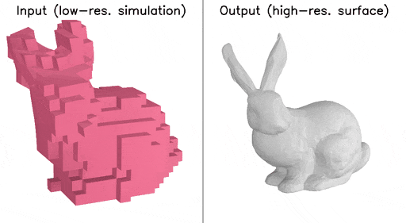
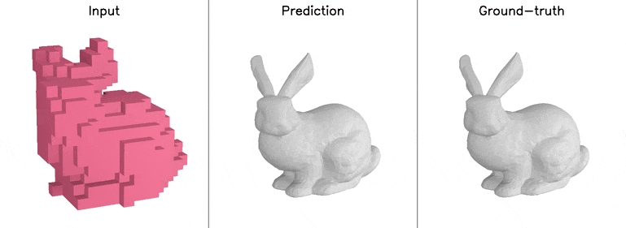

# 3D Simulation Super-Resolution

This is the official pytorch implementation of the following paper:

[Hyojoon Park](https://hjoonpark.github.io/), [Sangeetha Grama Srinivasan](https://pages.cs.wisc.edu/~sgsrinivasa2/), [Matthew Cong](https://physbam.stanford.edu/~mdcong/), [Doyub Kim](https://doyub.com/), [Byungsoo Kim](https://www.byungsoo.me/), [Jonathan Swartz](https://github.com/swahtz), [Ken Museth](https://ken.museth.org/Biography.html), and [Eftychios Sifakis](https://pages.cs.wisc.edu/~sifakis/).
 **"[Near-realtime facial animation by deep 3d simulation super-resolution.](https://dl.acm.org/doi/full/10.1145/3670687)"** ACM Transactions on Graphics 43, no. 5 (2024): 1-20.
*(Presented at SIGGRAPH ASIA 2024)*

This repository contains the implementation of a neural network-based simulation super-resolution framework that can efficiently and realistically enhance a facial performance produced by a low-cost, real-time physics-based simulation to a level of detail that closely approximates that of a reference-quality off-line simulator with much higher resolution (27x element count in our examples) and accurate physical modeling.

# Model architecture

Please refer to our [paper](https://dl.acm.org/doi/full/10.1145/3670687) for more details.

# Example dataset

We provide an example dataset consisting of low- and high-resolution simulation pairs using the [Stanford Bunny](https://graphics.stanford.edu/data/3Dscanrep/). These examples are located in `./data/train` and `./data/test`. The facial simulation dataset used in the paper is not included due to copyright restrictions.

### Training dataset

256 pairs of `{lowres, highres}` frames generated by simulating random head rotations along the `(yaw, pitch, roll)` axes.

### Inference results

Inference results (`./result_example/test`) on 40 unseen frames, generated by sequentially rotating the head along the `(yaw, pitch)` axes, only (i.e., not included in training):

 

# Training 

- Example pairs of `{lowres, highres}` simulation data are provided in:

    - `./data/train`: 256 training frames
    - `./data/test`: 40 test frames

- To train the model with the default settings, run:

      python train.py

- Example training results during training are saved in `./result_example`.

# Inference

- A pretrained model is available in `./pretrained/model_latest.pth`
- To perform inference on the 40 example test frames (`./data/test`), run:

      python test.py

- Example inference results are saved in `./result_example/test`.

# Performance testing

- Measures the average inference time using a *synthetic* dataset with the same dimensions as the facial dataset described in the paper. The facial simulation dataset used in the paper is not included due to copyright restrictions.

- To measure inference timing, run:

      python test_inference_time.py

- Example terminal output:

      Start
      PosEmb init
      EmbModule init
      EmbModule init
      FeatEmb init
      Upscale init
      Decoder init
      SuperRes init
      --------------------------------------
      iterations = 5
      average = 66.569 ms
      --------------------------------------
      Done

# Tested versions

 The implementation has been tested on the following configuration:

- Ubuntu 20.04.6 LTS
- python 3.9.12
- pytorch 1.13.1
- cuda 11.7
- matplotlib 3.7.2

# Citation

If you find this work useful in your research, please cite our paper:

     @article{park2024near,
     title={Near-realtime Facial Animation by Deep 3D Simulation Super-Resolution},
          author={Park, Hyojoon and Grama Srinivasan, Sangeetha and Cong, Matthew and Kim, Doyub and Kim, Byungsoo and Swartz, Jonathan and Museth, Ken and Sifakis, Eftychios},
          journal={ACM Transactions on Graphics},
          volume={43},
          number={5},
          pages={1--20},
          year={2024},
          publisher={ACM New York, NY, USA}
     }
     

