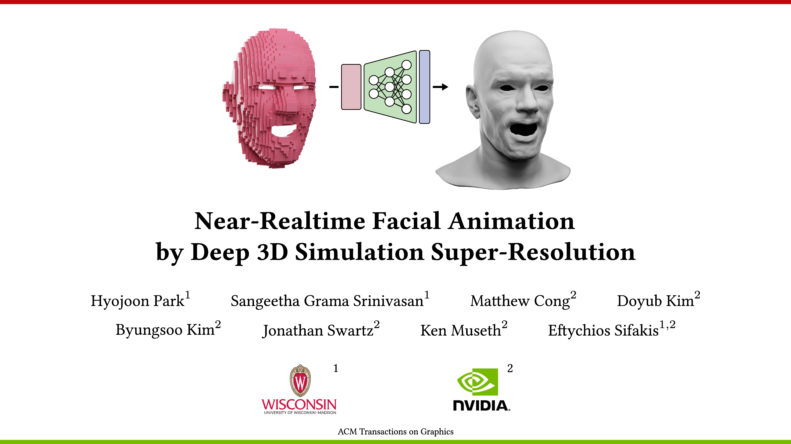
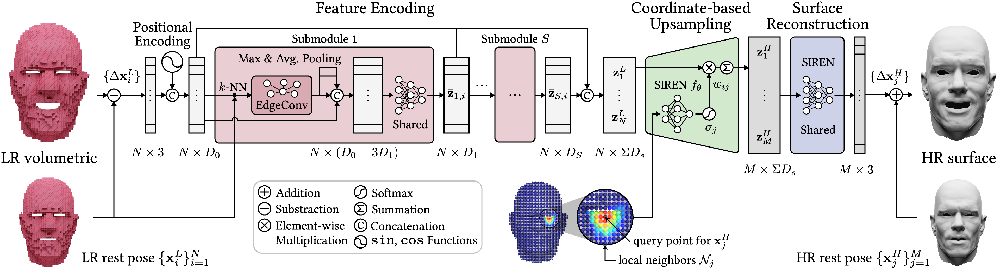

# (More details to come)

# 3D Simulation Super-Resolution

# Architecture

# Installation

Tested versions
 
     python 3.11.9
     pytorch 2.3.0

# Run inference

    python test.py

# Citation

     @article{park2024near,
     title={Near-realtime Facial Animation by Deep 3D Simulation Super-Resolution},
     author={Park, Hyojoon and Grama Srinivasan, Sangeetha and Cong, Matthew and Kim, Doyub and Kim, Byungsoo and Swartz, Jonathan and Museth, Ken and Sifakis, Eftychios},
     journal={ACM Transactions on Graphics},
     volume={43},
     number={5},
     pages={1--20},
     year={2024},
     publisher={ACM New York, NY, USA}
     }
