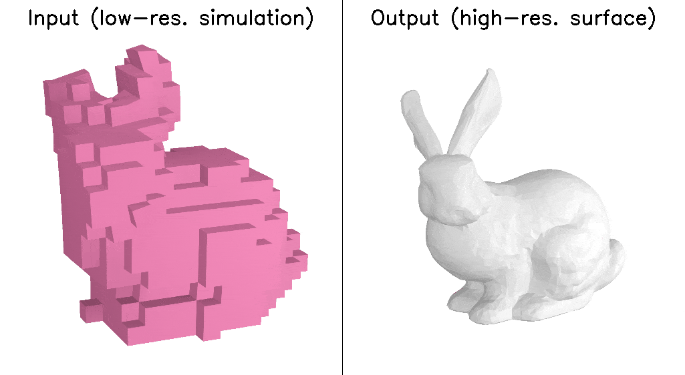
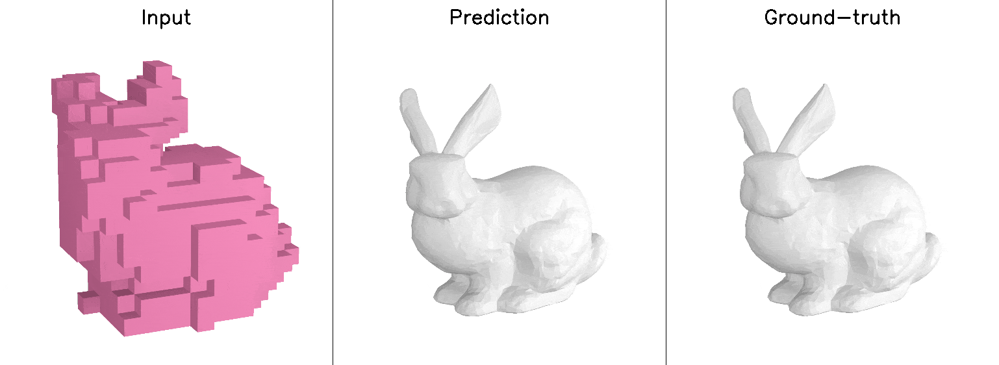

# (More details to come)

# 3D Simulation Super-Resolution

This is the official pytorch implementation of the following paper:

Hyojoon Park, Sangeetha Grama Srinivasan, Matthew Cong, Doyub Kim, Byungsoo Kim, Jonathan Swartz, Ken Museth, and Eftychios Sifakis. **"[Near-realtime facial animation by deep 3d simulation super-resolution.]()https://dl.acm.org/doi/full/10.1145/3670687"** ACM Transactions on Graphics 43, no. 5 (2024): 1-20.

This code implements the neural network-based simulation super-resolution framework that can efficiently and realistically enhance a facial performance produced by a low-cost, real-time physics-based simulation to a level of detail that closely approximates that of a reference-quality off-line simulator with much higher resolution (27x element count in our examples) and accurate physical modeling.

<!-- # Architecture
 -->

# Example data

We provide as example data the pairs of low- and high-resolution of the [Stanford Bunny](https://graphics.stanford.edu/data/3Dscanrep/) simulated using the same simulation parameters (`./data/train` and `./data/test`).

### Training data (randomly generated 512 pairs of `(lowres, highres)` frames)

### Inference result (40 frames unseen during the training)

# Training

-  Inside `./data/train` and `'./data/test` are the example pairs of `(lowres, highres)` for 512 `training` frames and 40 `test` frames, respectively.
- `./result_example` are the example results saved during our training.
- Training using the default settings:

      python train.py

# Inference

- `./pretrained/model_latest.pth` is our pretrained model on the example dataset.
- Inferencing on the 40 example test frames (unseen during training):

      python test.py

# Performance testing

- Computes the average inference time on the *synthetic* dataset with the same dimensions as the facial dataset used in the paper. 
     We do not provide the actual face simulation dataset due to copyright reasons.

- Measuring the inference timing:

      python test_inference_time.py

- Below is an example output printed on the terminal:

      Start
      PosEmb init
      EmbModule init
      EmbModule init
      FeatEmb init
      Upscale init
      Decoder init
      SuperRes init
      --------------------------------------
      iterations = 5
      average = 66.569 ms
      --------------------------------------
      Done

# Tested versions
 
     Ubuntu 20.04.6 LTS
     python 3.9.12
     pytorch 1.13.1
     cuda 11.7
     matplotlib 3.7.2

# Contact

If you have any questions, please contact the paper authors.

# Citation

Please cite the following paper if this model helps your research:

     @article{park2024near,
     title={Near-realtime Facial Animation by Deep 3D Simulation Super-Resolution},
     author={Park, Hyojoon and Grama Srinivasan, Sangeetha and Cong, Matthew and Kim, Doyub and Kim, Byungsoo and Swartz, Jonathan and Museth, Ken and Sifakis, Eftychios},
     journal={ACM Transactions on Graphics},
     volume={43},
     number={5},
     pages={1--20},
     year={2024},
     publisher={ACM New York, NY, USA}
     }
     

